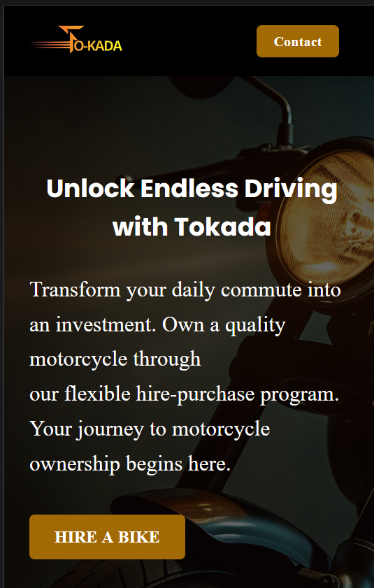
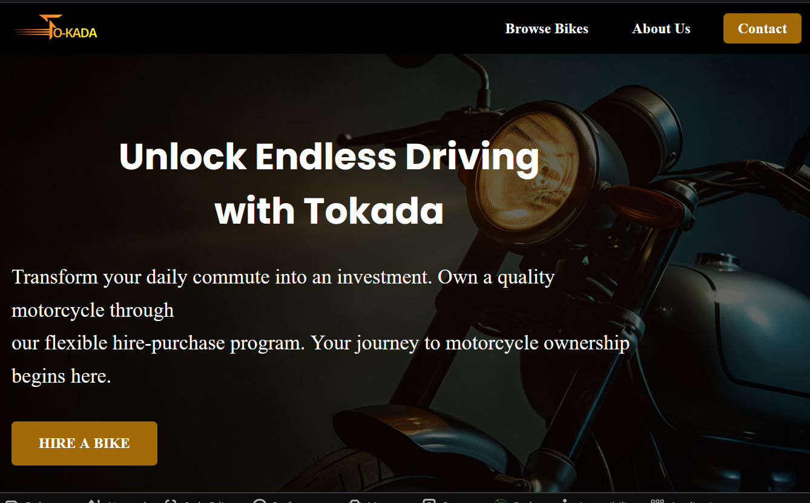

# Tokada Hire Purchase Website

Modern, responsive website for Tokada Business Solutions - a motorcycle hire
purchase company in Nigeria.

## Features

- Responsive design across all devices
- Customer testimonials and reviews
- Contact form with validation
- FAQ section with filtering
- Social media integration

## Tech Stack

- HTML5, CSS3, JavaScript
- Font Awesome icons
- Google Fonts (Roboto, Poppins)

## 📸 Screenshots

| Mobile View                                   | Desktop-view                                   |
| --------------------------------------------- | ---------------------------------------------- |
|  |  |

## Quick Start

```bash
git clone https://github.com/yourusername/tokada-hire-purchase.git
cd tokada-hire-purchase
```

## Project Structure

```
├── index.html          # Main HTML file
├── style.css           # Stylesheet
├── app.js             # JavaScript functionality
└── assets/            # Images and media
    ├── Logo.png
    ├── Bike.jpg
    └── [other images]
```

## Required Images

Place these images in the `assets/` folder:

**Brand & Sections:**

- `Logo.png` - Company logo
- `Bike.jpg` - Hero background
- `Biker (1).jpg`, `Biker (2).jpg` - Section images
- `proffession2.jpg` - About section

**Features & Testimonials:**

- `Tokada2.jpg`, `Tokada6.jpg`, `Tokada7.jpg` - Feature cards
- `pms-1.jpg`, `pms-2.jpg`, `pms-3.jpg` - Customer photos

**Product Features:**

- `Yamaha Engine.jpg`, `Yamaha Seat.jpeg`, `Yamaha head light.jpg`
- `Yamaha wider foot rest.jpg`, `Yamaha tank cover.jpg`

## Deployment

**GitHub Page:**

1. Site available at `https://yourusername.github.io/repo-name`

🌐 Live Demo

🚀 Live on Netlify: https://bills-with-buddies.netlify.app/

## Contact

- **WhatsApp**: +234 812 110 4257
- **Social**: Facebook | Instagram | YouTube | TikTok

## License

© 2024 Tokada Business Solutions. All rights reserved.
